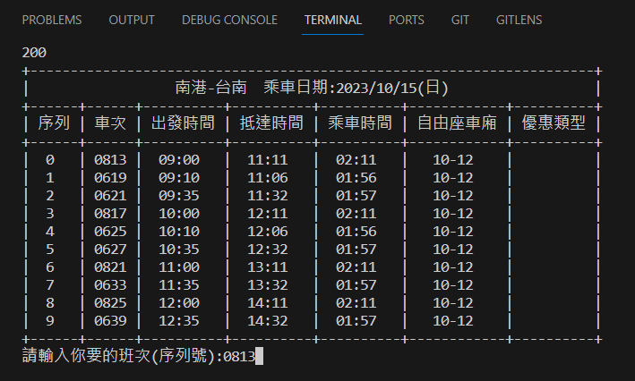
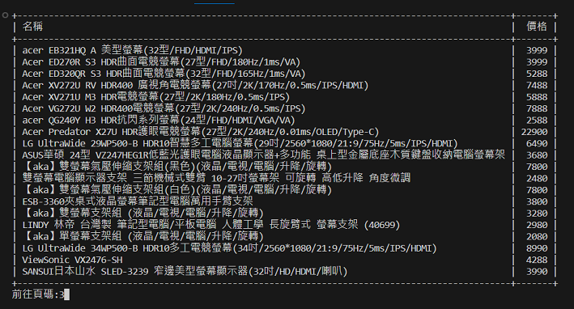
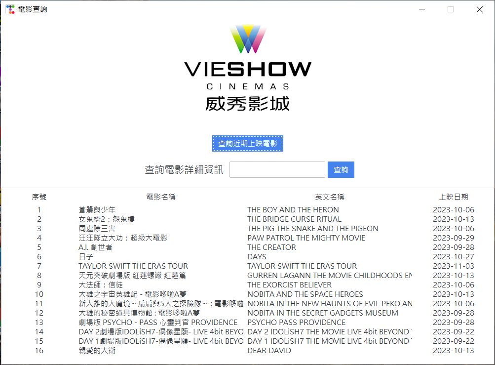
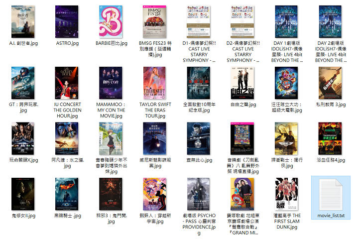

# WebCrawler爬蟲
## 高鐵自動訂票
### 項目簡介
> 直接輸入時間地點快速得到車次資料,
> 後續訂票繁瑣手動流程交給selenium,
>

- 1.輸入乘車時間 起迄站
- 2.顯示出查詢時間之後車次列表
- 3.選擇要訂票的車次
### 功能演示

- 4.選擇車次並輸入個人資料
- 5.後續由selenium自動完成訂票流程

## Pchome商品快速搜尋
### 項目簡介
> 輸入想查詢的商品
> 直接顯示品項與價格
> 減少頁面廣告干擾
- 1.輸入搜尋商品名稱
- 2.可以輸入頁數做商品切換
### 功能演示

## 影城最新上映資訊查詢
### 項目簡介
> 使用ttk套件顯示操控面板
> 可以查詢最新上映的電影
> 以及選擇序號來查看電影簡介
### 功能演示
- 近期上映電影名稱
  

- 下載電影海報

